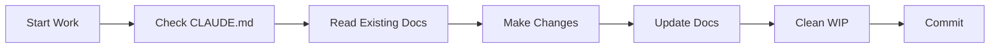

# Documentation Management Rules

## Core Principles

### Documentation Organization

- **Keep documentation WITH the code** - Package docs stay in package directories
- **No WIP accumulation** - Clean up `/wip` directories after implementation
- **Maintain references** - Always link to related documentation
- **Version control friendly** - Use markdown for all documentation

## Directory Structure

### Standard Package Documentation

```
packages/[package-name]/
├── README.md           # User-facing documentation
├── CLAUDE.md          # Agent-specific instructions
├── docs/              # Detailed documentation
│   ├── technical/     # Technical specifications
│   ├── examples/      # Usage examples
│   └── planning/      # Archived planning docs
└── src/              # Implementation
```

### Documentation Locations

| Type                   | Location          | Purpose                      |
| ---------------------- | ----------------- | ---------------------------- |
| **User Docs**          | `README.md`       | How to use the package       |
| **Agent Instructions** | `CLAUDE.md`       | Claude-specific guidelines   |
| **Technical Specs**    | `docs/technical/` | Detailed specifications      |
| **Planning Archives**  | `docs/planning/`  | Historical design decisions  |
| **API Reference**      | `docs/api/`       | Generated from code comments |

## Maintenance Rules

### After Implementation

1. **Move WIP files** to appropriate package `docs/` directory
2. **Archive planning documents** in `docs/planning/`
3. **Update README.md** with current usage instructions
4. **Create/Update CLAUDE.md** with agent guidelines
5. **Clean up `/wip` directory** - should be empty after implementation

### During Development

1. **Update docs immediately** when changing functionality
2. **Keep examples current** - test them regularly
3. **Document decisions** in appropriate location
4. **Link related docs** - avoid duplication

### Documentation Updates Checklist

- [ ] README.md reflects current functionality
- [ ] CLAUDE.md has current agent instructions
- [ ] Examples work with current code
- [ ] No stale files in `/wip`
- [ ] Planning docs archived properly
- [ ] API changes documented
- [ ] Breaking changes highlighted

## File References

### Required in Each Package

1. **README.md** - Public documentation
2. **CLAUDE.md** - Agent instructions (if complex package)
3. **LICENSE** - If different from root
4. **CHANGELOG.md** - For published packages

### Optional but Recommended

1. **CONTRIBUTING.md** - Contribution guidelines
2. **docs/architecture.md** - Design decisions
3. **docs/troubleshooting.md** - Common issues

## WIP Directory Management

### Purpose

- **Temporary planning** only
- **Exploration and prototyping**
- **External documentation** (PDFs, diagrams)

### Cleanup Rules

1. After implementation → Move to package docs
2. After abandonment → Archive in `docs/abandoned/`
3. Regular reviews → Monthly WIP directory audit

### Never in WIP

- Production code
- Long-term documentation
- Configuration files
- Test files

## Documentation Quality Standards

### Every Document Must Have

1. **Title and purpose** at the top
2. **Date or version** for tracking
3. **Clear sections** with headers
4. **Examples** where applicable
5. **Links** to related docs

### Writing Style

- **Be concise** - Get to the point quickly
- **Use examples** - Show, don't just tell
- **Stay current** - Update immediately after changes
- **Be searchable** - Use clear, descriptive headers

## Agent Instructions

### For All Agents

1. **Check CLAUDE.md first** in any package
2. **Update docs after changes** - No exceptions
3. **Clean up after yourself** - Move WIP files
4. **Link don't duplicate** - Reference existing docs
5. **Test examples** - Ensure they work

### Documentation Workflow



## Enforcement

### Pre-commit Checks

- No files in `/wip` older than 30 days
- All packages have README.md
- CLAUDE.md exists for complex packages

### Regular Audits

- Weekly: WIP directory review
- Monthly: Documentation accuracy check
- Quarterly: Full documentation review

## Examples of Good Documentation

### Good CLAUDE.md

```markdown
# Package Name - Claude Instructions

## Quick Start

[Immediate actionable info]

## Key Files

[Where to look for what]

## Common Tasks

[Step-by-step guides]

## Gotchas

[Known issues and solutions]
```

### Good README.md

```markdown
# Package Name

## Installation

[Clear install steps]

## Usage

[Working examples]

## API

[Complete reference]

## Contributing

[How to help]
```

---

**Remember**: Documentation is code. Treat it with the same care, review it with the same rigor, and maintain it with the same discipline.
