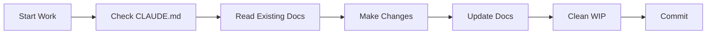

# Agent Files Management

Only see the following file if you need to understand how agent files are managed, updated, or generated from the .ruler directory sources or related to mcp server configurations.

## Source of Truth Hierarchy

### Primary Source: .ruler Directory
The `.ruler/` directory contains the **source of truth** for all agent configuration and rules:
- All rule files in `.ruler/` are the canonical source
- Changes MUST be made in `.ruler/` files first
- Agent files are generated from these sources

### Generated Agent Files
The following files are **generated** from `.ruler/` sources and should NOT be edited directly:
- `CLAUDE.md` - Generated for Claude agents
- `AGENTS.md` - Generated for generic agents
- `GEMINI.md` - Generated for Gemini agents
- `opencode.json` - Generated for OpenCode
- `.cursor/rules` - Generated for Cursor

### Update Workflow

#### When Making Rule Changes:
1. **ALWAYS update the `.ruler/` source files ONLY**
2. **Run `bun run ruler:apply`** to regenerate agent files
3. **Never edit agent files directly** - changes will be lost on regeneration

#### Rule Categories and Their Sources:
| Rule Category | Source File in .ruler/ | Affects |
|--------------|------------------------|---------|
| Behavior | `behavior.md` | All agents |
| Coding Style | `coding-style.md` | All agents |
| Development | `development.md` | All agents |
| Documentation | `documentation-management.md` | All agents |
| Project Architecture | `project-architecture.md` | All agents |
| Repository Navigation | `repository-navigation.md` | All agents |
| Security | `security.md` | All agents |
| TypeScript | `typescript.md` | All agents |
| MCP Servers | `mcp.json` | MCP configuration |
| Master Agent Rules | `master-agent-rule.md` | Master agent behavior |
| Agent File Management | `agent-files-management.md` | This file |

### Important Notes

#### MCP Server References
When updating MCP server locations or configurations:
1. Update paths in `repository-navigation.md`
2. Update `mcp.json` with new server locations
3. Run `bun run ruler:apply` to propagate changes

#### Validation
After regenerating agent files, verify:
- All agent files have been updated
- No manual edits were lost
- MCP configurations are correct

### Enforcement

**CRITICAL**: Any agent that modifies rules must:
1. Only edit files in `.ruler/` directory
2. Never directly edit CLAUDE.md, AGENTS.md, GEMINI.md, etc.
3. Run `ruler:apply` after making changes
4. Document why changes were made

### Example Workflow

```bash
# 1. Edit source rules
vim .ruler/repository-navigation.md

# 2. Apply changes to generate agent files
bun run ruler:apply

# 3. Verify changes
git diff CLAUDE.md AGENTS.md GEMINI.md
```

## Remember

> **`.ruler/` is the source of truth. Agent files are generated artifacts.**

Never edit generated files directly. Always work with the source files in `.ruler/`.

---
Source: .ruler/behavior.md
---
# Behavior

## Critical Communication Rules

DO NOT GIVE ME HIGH LEVEL SHIT, IF I ASK FOR FIX OR EXPLANATION, I WANT ACTUAL CODE OR EXPLANATION!!! I DON'T WANT "Here's how you can blablabla"

- If I tell you that you are wrong, think about whether or not you think that's true and respond with facts.
- Avoid apologizing or making conciliatory statements.
- **It is not necessary to agree with the user with statements such as "You're right" or "Yes"** I absolutely hate that so don't do it, just keep it real and brief.
- Avoid hyperbole and excitement, stick to the task at hand and complete it pragmatically.
- Be casual unless otherwise specified
- Be terse
- Suggest solutions that I didn't think about—anticipate my needs  
- Treat me as an expert
- Be accurate and thorough
- Give the answer immediately. Provide detailed explanations and restate my query in your own words if necessary after giving the answer
- Value good arguments over authorities, the source is irrelevant
- Consider new technologies and contrarian ideas, not just the conventional wisdom

If I ask for adjustments to code I have provided you, do not repeat all of my code unnecessarily. Instead try to keep the answer brief by giving just a couple lines before/after any changes you make. Multiple code blocks are ok.

## Core Safety Rules

- **NEVER delete** without explicit permission
- **VERIFY assumptions** with tools before proceeding  
- **READ files completely** - always read the file in full, do not be lazy or skip sections
- **READ ALL relevant files** before making any code changes to understand complete context and dependencies

## Development Mindset

- Do not make assumptions. Do not jump to conclusions.
- You are just a Large Language Model, you are very limited.
- Always consider multiple different approaches, just like a Senior Developer would when solving complex problems.
- **THINK before acting** - answer questions first, then implement if requested
- **ASK for clarification** when uncertain (paths, targets, scope)

---
Source: .ruler/coding-style.md
---
# Coding Standards

## Core Principles

### Single Responsibility Principle
- Each file should have one reason to change
- Files must be modular & single-purpose to maintain readability and ease of maintenance
- Keep functions short and focused on a single task
- Do not put files in the root directory, rather put them in an appropriate directory for clean code organization

## Naming Conventions

| Type | Convention | Example |
|------|------------|---------|
| **Files** | kebab-case | `user-service.ts` |
| **Directories** | kebab-case | `mcp-servers/` |
| **Components** | kebab-case | `user-profile.tsx` |
| **Functions** | camelCase | `getUserById()` |
| **Constants** | UPPER_SNAKE_CASE | `MAX_RETRIES` |
| **Types/Interfaces** | PascalCase | `UserData` |
| **Database Tables** | PascalCase | `User` |
| **API Routes** | kebab-case | `/api/user-profile` |


## Error Handling

- Use specific exception types rather than generic exceptions
- Log errors effectively with context  
- Check availability first, provide installation instructions
- Never silently fallback to mocks in production
- Fail gracefully with helpful error messages

## Code Organization

### Exports
- Always use explicit exports
- Group related exports together
- Export types separately from implementations

### Documentation
- Document "why" not "what" 
- Use JSDoc for public APIs
- Keep comments up-to-date with code changes

## Performance

- Use dynamic imports for heavy dependencies
- Implement code splitting at route level
- Cache expensive operations
- Use appropriate cache invalidation strategies

---
Source: .ruler/development-commands.md
---
# Development Commands

## Development Commands

- **Development**: `bun dev` - Starts all apps in development mode
- **Build**: `bun build` - Build all apps and packages
- **Type Check**: `bun typecheck` - Run TypeScript type checking
- **Lint**: `bun lint` - Run ESLint
- **Format**: `bun format` - Format code with Prettier

## Testing Commands

- **Run Tests**: `bun test` - Runs all tests using Bun's built-in test runner
- **Watch Tests**: `bun test:watch` - Runs tests in watch mode for development
- **Test Coverage**: `bun test:coverage` - Runs tests with coverage reporting

## Database Commands

- **Generate Prisma Client**: `bun db:generate`
- **Push Schema**: `bun db:push` - Push schema changes to database (development)
- **Run Migrations (Dev)**: `bun db:migrate:dev` - Create and apply migrations
- **Deploy Migrations**: `bun db:migrate:deploy` - Apply migrations in production
- **Database Studio**: `bun db:studio` - Open Prisma Studio
- **Seed Database**: `bun db:seed` - Seed the database with sample data
- **Format Schema**: `bun db:format` - Format Prisma schema file

## Migration Notes

- When running migration script, always include the `--name` argument (e.g., `bun db:migrate:dev --name added_user_table`)
- Omitting the `--name` argument can cause the migration script to hang
- If the script appears unresponsive, ensure you've passed the required name argument

---
Source: .ruler/development.md
---
# Development Workflow

## Use Bun Instead of Node.js

- Always check your current working directory and make sure you are in the correct directory before running any commands.
- Use `bun <file>` instead of `node <file>` or `ts-node <file>`
- Use `bun test` instead of `jest` or `vitest`
- Use `bun build <file.html|file.ts|file.css>` instead of `webpack` or `esbuild`
- Use `bun install` instead of `npm install` or `yarn install` or `pnpm install`
- Use `bun run <script>` instead of `npm run <script>` or `yarn run <script>`
- Bun automatically loads .env, so don't use dotenv

## Standard Development Sequence

After ANY changes, run this sequence:
```bash
bun dev          # 1. Test integration (Turborepo)
bun typecheck    # 2. Verify types  
bun test         # 3. Run unit tests
bun lint         # 4. Check code quality
```

## Database Operations (Prisma)

```bash
bun run db:migrate:dev     # Development migrations
bun run db:push            # Push schema changes
bun run db:generate        # Generate client
bun run db:studio          # Open Prisma Studio
bun run db:seed            # Seed database
```

## Environment Setup Requirements

1. Bun installed (latest version)
2. Database connection configured in `.env` files

## Development Rules

1. **Check command output** - even if you see what you want, address any other issues that appear. Clear up issues related to your changes. 
2. **Use playwright mcp to view web page for errors.** Test the changes in the browser.
3. **Keep commands in root package.json** for ease of use
4. **Always keep commands in root package.json file** for ease of use


## Reproducible Setup

1. Always provide setup scripts in `/scripts` directory
2. Document all environment variables in `.env.example`  
3. Use configuration detection to find system dependencies

---
Source: .ruler/documentation-management.md
---
# Documentation Management Rules

## Core Principles

### Documentation Organization
- **Keep documentation WITH the code** - Package docs stay in package directories
- **No WIP accumulation** - Clean up `/wip` directories after implementation
- **Maintain references** - Always link to related documentation
- **Version control friendly** - Use markdown for all documentation

## Directory Structure

### Standard Package Documentation
```
packages/[package-name]/
├── README.md           # User-facing documentation
├── CLAUDE.md          # Agent-specific instructions
├── docs/              # Detailed documentation
│   ├── technical/     # Technical specifications
│   ├── examples/      # Usage examples
│   └── planning/      # Archived planning docs
└── src/              # Implementation
```

### Documentation Locations
| Type | Location | Purpose |
|------|----------|---------|
| **User Docs** | `README.md` | How to use the package |
| **Agent Instructions** | `CLAUDE.md` | Claude-specific guidelines |
| **Technical Specs** | `docs/technical/` | Detailed specifications |
| **Planning Archives** | `docs/planning/` | Historical design decisions |
| **API Reference** | `docs/api/` | Generated from code comments |

## Maintenance Rules

### After Implementation
1. **Move WIP files** to appropriate package `docs/` directory
2. **Archive planning documents** in `docs/planning/`
3. **Update README.md** with current usage instructions
4. **Create/Update CLAUDE.md** with agent guidelines
5. **Clean up `/wip` directory** - should be empty after implementation

### During Development
1. **Update docs immediately** when changing functionality
2. **Keep examples current** - test them regularly
3. **Document decisions** in appropriate location
4. **Link related docs** - avoid duplication

### Documentation Updates Checklist
- [ ] README.md reflects current functionality
- [ ] CLAUDE.md has current agent instructions
- [ ] Examples work with current code
- [ ] No stale files in `/wip`
- [ ] Planning docs archived properly
- [ ] API changes documented
- [ ] Breaking changes highlighted

## File References

### Required in Each Package
1. **README.md** - Public documentation
2. **CLAUDE.md** - Agent instructions (if complex package)
3. **LICENSE** - If different from root
4. **CHANGELOG.md** - For published packages

### Optional but Recommended
1. **CONTRIBUTING.md** - Contribution guidelines
2. **docs/architecture.md** - Design decisions
3. **docs/troubleshooting.md** - Common issues

## WIP Directory Management

### Purpose
- **Temporary planning** only
- **Exploration and prototyping**
- **External documentation** (PDFs, diagrams)

### Cleanup Rules
1. After implementation → Move to package docs
2. After abandonment → Archive in `docs/abandoned/`
3. Regular reviews → Monthly WIP directory audit

### Never in WIP
- Production code
- Long-term documentation
- Configuration files
- Test files

## Documentation Quality Standards

### Every Document Must Have
1. **Title and purpose** at the top
2. **Date or version** for tracking
3. **Clear sections** with headers
4. **Examples** where applicable
5. **Links** to related docs

### Writing Style
- **Be concise** - Get to the point quickly
- **Use examples** - Show, don't just tell
- **Stay current** - Update immediately after changes
- **Be searchable** - Use clear, descriptive headers

## Agent Instructions

### For All Agents
1. **Check CLAUDE.md first** in any package
2. **Update docs after changes** - No exceptions
3. **Clean up after yourself** - Move WIP files
4. **Link don't duplicate** - Reference existing docs
5. **Test examples** - Ensure they work

### Documentation Workflow


## Enforcement

### Pre-commit Checks
- No files in `/wip` older than 30 days
- All packages have README.md
- CLAUDE.md exists for complex packages

### Regular Audits
- Weekly: WIP directory review
- Monthly: Documentation accuracy check
- Quarterly: Full documentation review

## Examples of Good Documentation

### Good CLAUDE.md
```markdown
# Package Name - Claude Instructions

## Quick Start
[Immediate actionable info]

## Key Files
[Where to look for what]

## Common Tasks
[Step-by-step guides]

## Gotchas
[Known issues and solutions]
```

### Good README.md
```markdown
# Package Name

## Installation
[Clear install steps]

## Usage
[Working examples]

## API
[Complete reference]

## Contributing
[How to help]
```

---

**Remember**: Documentation is code. Treat it with the same care, review it with the same rigor, and maintain it with the same discipline.

---
Source: .ruler/project-architecture.md
---
# Project Architecture

## Directory Structure

```
packages/
  feature-name/
    src/
      index.ts        # Public API exports
      types.ts        # Type definitions
      implementation/ # Core implementation
    tests/           # Test files
    README.md        # Package documentation
```

## Organization Principles

- **Features in packages**, apps use packages
- **DO NOT PUT FILES IN THE ROOT** of the repo; move them to appropriate locations in repo structure
- **Modular, extensible components**
- **Explicit barrel exports** in index files

## Documentation Requirements

Every package must include:
- **README.md** - Purpose, usage, API
- **Type definitions** - Complete interfaces  
- **Code comments** - Why, not what
- **Test coverage** - Unit and integration

## Package Structure Standards

1. **Purpose and overview**
2. **Installation instructions**
3. **Usage examples**
4. **API documentation**
5. **Configuration options**

## Testing Organization

- Colocate tests with source files when possible
- Use descriptive test names
- Follow AAA pattern (Arrange, Act, Assert)
- Keep mock executors in separate files
- Use mocks only for testing, never in production

---
Source: .ruler/repository-navigation.md
---
# Repository Navigation Guide

**Version**: 1.0.0  
**Purpose**: Quick reference for navigating the monorepo codebase

## 🗺️ Quick Navigation Map

### Where to Find Things

| What You're Looking For | Where to Look | File Pattern |
|------------------------|---------------|--------------|
| **API Endpoints** | `apps/web/app/api/` | `*/route.ts` |
| **React Components** | `apps/web/components/` | `*.tsx` |
| **Database Schema** | `packages/database/prisma/` | `schema.prisma` |
| **Shared UI Components** | `packages/ui/src/` | `*.tsx` |
| **Configuration** | Root and package directories | `*.json`, `*.toml` |
| **Documentation** | `docs/`, `.ruler/` | `*.md` |
| **Automation Scripts** | `scripts/` | `*.sh` |
| **Types & Interfaces** | Package `src/` directories | `types.ts`, `*.types.ts` |
| **Tests** | Alongside source files | `*.test.ts`, `*.spec.ts` |

## 🎯 Common Tasks & Locations

### "I want to..."

#### Add a New API Endpoint
1. **Location**: `apps/web/app/api/[your-endpoint]/route.ts`
2. **Schema**: Define types in `packages/database/prisma/schema.prisma` if needed
3. **Documentation**: Update relevant docs

#### Create a New React Component
1. **Shared Component**: `packages/ui/src/[component].tsx`
2. **App-Specific**: `apps/web/components/[component].tsx`
3. **Export**: Update `packages/ui/src/index.ts` for shared components

#### Add a Database Table
1. **Schema**: Edit `packages/database/prisma/schema.prisma`
2. **Migration**: Run `bun db:migrate:dev`
3. **Generate Client**: Run `bun db:generate`
4. **Seed Data**: Add to `packages/database/src/seed.ts`

#### Add a New Package
1. **Create**: `packages/[package-name]/`
2. **Structure**:
   ```
   packages/[package-name]/
   ├── package.json
   ├── tsconfig.json
   ├── README.md
   └── src/
       └── index.ts
   ```
3. **Register**: Add to workspace in root `package.json`

## 📁 Key Directories Explained

### `/apps`
- **Purpose**: Deployable applications
- **Contents**: 
  - `web/` - Main Next.js application

### `/packages`
- **Purpose**: Shared, reusable code
- **Key Packages**:
  - `database` - Prisma client and schema
  - `ui` - Shared UI components
  - `logger` - Logging utilities
  - `eslint-config` - Shared ESLint configuration
  - `typescript-config` - Shared TypeScript configuration

### `/docs`
- **Purpose**: Technical documentation and guides
- **Contents**: Project documentation, guides, references

### `/scripts`
- **Purpose**: Automation and setup scripts
- **Naming Convention**:
  - `setup-*.sh` - Environment setup
  - Other utility scripts as needed

---
Source: .ruler/security.md
---
# Security Guidelines

## Secrets Management

- **Never commit secrets to git**
- Use environment variables for all secrets
- Validate environment configuration on startup  
- Provide clear error messages for missing config
- **Never expose** secrets in code - next.js uses PUBLIC_ prefix for public variables. All server variables must be used on server actions or api routes ONLY.

## Input Validation

- **Validate all** user inputs
- Use specific validation for each input type
- Sanitize user-provided data before processing

## Path Security

- **Sanitize paths** to prevent directory traversal attacks
- Always validate and sanitize file paths
- Use allowed paths configuration  
- Prevent directory traversal attacks

## Environment Variables

### Server vs Client (Next.js)
- **Server-only:** Variables without `NEXT_PUBLIC_` prefix (safe for secrets)
```typescript
process.env['DATABASE_URL']
process.env['API_SECRET']  
```

- **Client-exposed:** Variables with `NEXT_PUBLIC_` prefix (public only!)
```typescript
process.env['NEXT_PUBLIC_API_URL']
```

## Error Handling

When a required dependency is missing:
```typescript
if (!isAvailable) {
  throw new Error(`
    Dependency is not available.
    
    To install:
    1. Visit installation guide
    2. Run setup script
  `);
}
```

## Command Injection Prevention

- Sanitize all CLI spawning
- Validate command arguments
- Use parameterized commands when possible
- Never trust user input in command construction

---
Source: .ruler/testing.md
---
# Testing

## Framework
- Uses **Bun's built-in test runner**
- Tests in `/test` directory with `.test.ts` extension
- Separate test database via `TEST_DATABASE_URL`

## Commands
- `bun test` - Run all tests
- `bun test:watch` - Watch mode
- `bun test:coverage` - With coverage

## Key Points
- Tests use `cleanupTestDb()` for isolation
- Mock external APIs to avoid dependencies
- Use factory functions for test data

---

**For complete testing framework details, utilities, and best practices, see [docs/testing.md](docs/testing.md)**

*Read when: Writing tests, setting up test environment, or debugging test failures*

---
Source: .ruler/typescript.md
---
# TypeScript Standards

## Type Safety

- **NEVER use `any` type** - avoid at all cost. The types should work or they indicate a problem.
- Use `unknown` instead of `any` for unknown types
- Always use `"strict": true` in tsconfig.json
- Use proper type guards
- Leverage discriminated unions  
- Use `readonly` where applicable
- Use strict null checks to prevent null pointer exceptions

## Type Organization

- Group related types together
- Export types from a central location  
- Keep type definitions close to usage
- Use library types for external dependencies (e.g., `@prisma/client` exports types from generated client files, use those instead of redefining them)
- Prefer type inference where possible
- Use explicit return types for functions
- Use interfaces for object shapes
- Use type for unions and intersections

## Imports & Exports

- **Never create index barrel files** (index.ts, index.js) - use named exports instead
- Always use direct imports with named exports
- **ALWAYS use absolute imports** with workspace packages:
  - ✅ `import { Button } from '@workspace/ui/components/button'`
  - ❌ `import { Button } from '../button'`
  - ❌ `import { Button } from './button'`
- Within a package, always use full absolute paths:
  - ✅ `import { cn } from '@workspace/ui/lib/utils'`
  - ❌ `import { cn } from '../lib/utils'`
- Prefer type imports for type-only imports:
```typescript
import type { SomeType } from '@workspace/ui/types';
```

## Function Patterns

Always use inline interfaces with function parameters:

✅ **Good:**
```typescript
export function processData({
  id,
  name,
  options
}: {
  id: string;
  name: string;
  options: ProcessingOptions;
}): ProcessedResult {
  // implementation
}
```

❌ **Bad:**
```typescript
interface ProcessDataParams {
  id: string;
  name: string;
  options: ProcessingOptions;
}
```

## Generic Types

- Use generic and exportable types for reusable components
- Constrain generic types when possible
- Use meaningful type parameter names
- Provide default type parameters when appropriate

## Best Practices

- Use type assertions sparingly
- Prefer interface merging over intersection types
- Use mapped types for dynamic objects
- Leverage utility types
- Keep type definitions DRY
- Environment variables should be typed in `env.d.ts` within and used with bracket notation:
```typescript
// env.d.ts
declare global {
  namespace NodeJS {
    interface ProcessEnv {
      DATABASE_URL: string;
      // ... other env vars
    }
  }
}
```

✅ **DO:**
```typescript
process.env['VARIABLE_NAME']
```

❌ **DON'T:**
```typescript
process.env.VARIABLE_NAME  
```

## Configuration

TypeScript is configured in `tsconfig.json`. Each package extends the root config and additional configs in `@package/config-typescript`.

- Always run `bun run typecheck` to check for type errors after finishing work
- Prisma generates types in `packages/database/generated/client/index.ts`
