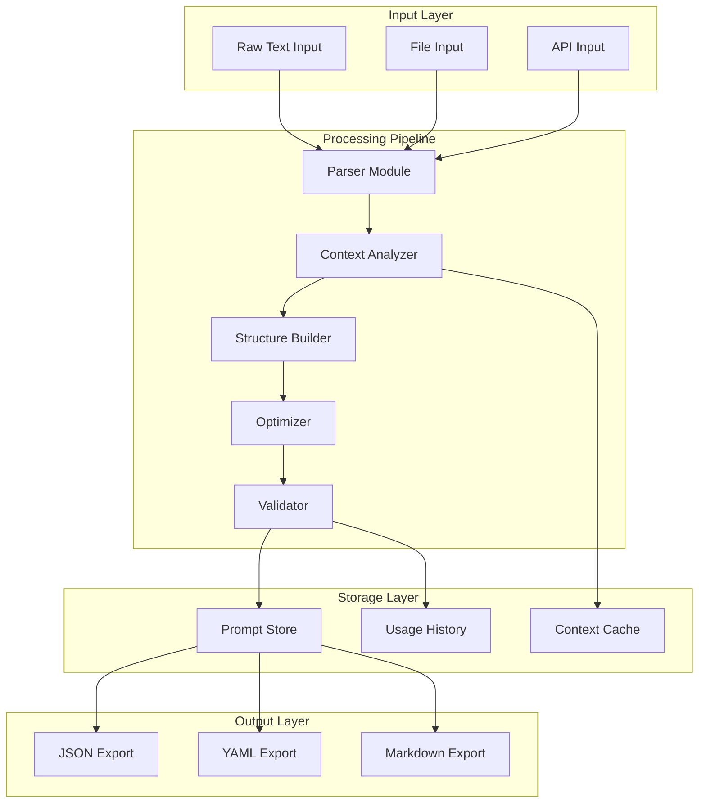

# Prompt Enhancer SDK - Technical Documentation

**Version**: 1.0.0  
**Package**: `@repo/prompt-enhancer`  
**Status**: Ready for Implementation  
**Review Date**: January 2025

## Executive Summary

The Prompt Enhancer SDK is a TypeScript library designed to transform raw, unstructured text inputs into validated, context-aware structured prompts for AI workflows. It integrates seamlessly with the AI Dr. architecture, leveraging existing codebase context to produce high-quality prompts that follow best practices for AI interaction.

## Table of Contents

1. [Overview](#overview)
2. [Architecture](#architecture)
3. [Core Features](#core-features)
4. [API Reference](#api-reference)
5. [Installation & Setup](#installation--setup)
6. [Usage Guide](#usage-guide)
7. [Testing Strategy](#testing-strategy)
8. [Integration Points](#integration-points)
9. [Performance Considerations](#performance-considerations)
10. [Security & Validation](#security--validation)
11. [Migration Guide](#migration-guide)
12. [Troubleshooting](#troubleshooting)

## Overview

### Problem Statement
Users often write vague or incomplete prompts that result in suboptimal AI responses. The SDK addresses this by:
- Analyzing raw input to extract intent
- Adding relevant codebase context
- Structuring prompts according to proven patterns
- Validating completeness and clarity
- Providing actionable improvement suggestions

### Key Benefits
- **Consistency**: All prompts follow a validated structure
- **Context-Aware**: Automatically includes relevant project information
- **Quality Assurance**: Built-in validation ensures prompt effectiveness
- **Workflow Integration**: Supports different work contexts (bug, feature, PR)
- **Reusability**: Store and retrieve successful prompt patterns

## Architecture

### System Design



### Module Responsibilities

| Module | Responsibility | Key Methods |
|--------|---------------|-------------|
| **Parser** | Extract intent and structure from raw text | `parse()`, `detectWorkflowType()`, `extractRequirements()` |
| **Context Analyzer** | Gather relevant codebase information | `analyze()`, `findRelevantFiles()`, `extractDependencies()` |
| **Structure Builder** | Create structured prompt format | `build()`, `applyTemplate()`, `generateSections()` |
| **Optimizer** | Improve clarity and effectiveness | `optimize()`, `clarify()`, `addExamples()` |
| **Validator** | Ensure quality and completeness | `validate()`, `score()`, `suggest()` |
| **Storage** | Persist and retrieve prompts | `save()`, `load()`, `search()`, `update()` |

## Core Features

### 1. Intelligent Parsing
- Natural language processing to extract intent
- Automatic workflow type detection
- Requirement extraction from unstructured text

### 2. Context Awareness
- Codebase analysis for relevant files
- Dependency detection
- Technical stack identification
- Current state assessment

### 3. Structured Output
- Consistent prompt format
- Clear separation of instruction, context, and expectations
- Success criteria generation
- Constraint identification

### 4. Validation System
- Quality scoring (0-100)
- Issue detection with severity levels
- Actionable improvement suggestions
- Best practice compliance

### 5. Storage & Retrieval
- Persistent prompt library
- Version control
- Search capabilities
- Usage tracking

## API Reference

### Main Class: `PromptEnhancerSDK`

```typescript
class PromptEnhancerSDK {
  constructor(config: PromptEnhancerConfig)
  
  // Core methods
  enhance(raw: string | RawPromptInput): Promise<StructuredPrompt>
  validate(prompt: StructuredPrompt): ValidationResult
  store(prompt: StructuredPrompt): Promise<string>
  retrieve(id: string): Promise<StructuredPrompt>
  update(id: string, updates: Partial<StructuredPrompt>): Promise<StructuredPrompt>
  search(query: PromptSearchQuery): Promise<StructuredPrompt[]>
  export(prompt: StructuredPrompt, format: 'json' | 'yaml' | 'markdown'): string
}
```

### Configuration Options

```typescript
interface PromptEnhancerConfig {
  projectPath: string;              // Root path of the project
  outputDir?: string;               // Where to store prompts (default: .prompts/)
  enableCodebaseContext?: boolean;  // Include code analysis (default: true)
  maxContextTokens?: number;        // Token limit for context (default: 4000)
  templateLibrary?: PromptTemplate[]; // Custom templates
}
```

### Core Types

```typescript
interface StructuredPrompt {
  id: string;
  version: string;
  workflow: WorkflowType;
  instruction: string;
  context: PromptContext;
  inputs: PromptInput[];
  expectedOutput: OutputSpecification;
  validation: ValidationResult;
  metadata: PromptMetadata;
  clarifyingQuestions?: string[];
  successCriteria?: string[];
  constraints?: string[];
  examples?: Example[];
}

enum WorkflowType {
  FEATURE = 'feature',
  BUG = 'bug',
  REFACTOR = 'refactor',
  DOCUMENTATION = 'documentation',
  RESEARCH = 'research',
  PR_REVIEW = 'pr_review',
  GENERAL = 'general'
}
```

## Installation & Setup

### 1. Package Installation

```bash
# Add to workspace
bun add @repo/prompt-enhancer

# Install dependencies
cd packages/prompt-enhancer
bun install
```

### 2. Environment Configuration

```bash
# .env
PROMPT_ENHANCER_OUTPUT_DIR=.prompts
PROMPT_ENHANCER_MAX_TOKENS=4000
PROMPT_ENHANCER_ENABLE_CACHE=true
```

### 3. CLI Setup

```bash
# Make CLI script executable
chmod +x scripts/enhance-prompt.ts

# Add to package.json scripts
"scripts": {
  "enhance": "bun run scripts/enhance-prompt.ts"
}
```

## Usage Guide

### Basic Enhancement

```typescript
import { PromptEnhancerSDK } from '@repo/prompt-enhancer';

const enhancer = new PromptEnhancerSDK({
  projectPath: process.cwd(),
  enableCodebaseContext: true
});

// Simple text input
const enhanced = await enhancer.enhance(
  "Add process ID to logger for multithreaded tracking"
);

console.log(enhanced.instruction);
// Output: "Implement process ID tracking in the application logger to enable 
// grouped log analysis in a multithreaded Bun environment"
```

### Workflow-Specific Enhancement

```typescript
// Bug fix workflow
const bugPrompt = await enhancer.enhance({
  content: "Users can't login after password reset",
  type: WorkflowType.BUG,
  metadata: {
    taskId: 'BUG-123',
    tags: ['auth', 'critical']
  }
});

// Feature development workflow
const featurePrompt = await enhancer.enhance({
  content: "Add real-time notifications",
  type: WorkflowType.FEATURE,
  metadata: {
    author: 'john.doe',
    tags: ['websocket', 'ui']
  }
});
```

### CLI Usage

```bash
# Basic usage
bun enhance -f raw-prompt.txt

# With output
bun enhance -f prompt.txt -o enhanced.md

# Interactive mode
bun enhance -i -t feature

# Validate existing prompt
bun enhance -f prompt.json --validate-only
```

### Advanced Features

```typescript
// Search previous prompts
const similarPrompts = await enhancer.search({
  workflow: WorkflowType.BUG,
  tags: ['performance'],
  minScore: 80
});

// Update existing prompt
const updated = await enhancer.update('prompt-id-123', {
  successCriteria: [
    ...existing.successCriteria,
    'Performance improved by 50%'
  ]
});

// Export in different formats
const markdown = enhancer.export(enhanced, 'markdown');
const yaml = enhancer.export(enhanced, 'yaml');
```

## Testing Strategy

### Test Categories

1. **Unit Tests**: Individual module functionality
2. **Integration Tests**: Module interactions
3. **E2E Tests**: Complete workflows
4. **Performance Tests**: Speed and resource usage
5. **Validation Tests**: Quality scoring accuracy

### Test Coverage Requirements

- Minimum 80% code coverage
- 100% coverage for core enhancement pipeline
- All error paths tested
- Edge cases documented

### Key Test Scenarios

```typescript
describe('Critical Path Tests', () => {
  test('Enhances simple prompts', async () => {
    const result = await enhancer.enhance('Fix the bug');
    expect(result.validation.isValid).toBe(true);
  });
  
  test('Detects workflow type', async () => {
    const bug = await enhancer.enhance('Users report error');
    expect(bug.workflow).toBe(WorkflowType.BUG);
  });
  
  test('Adds codebase context', async () => {
    const result = await enhancer.enhance('Update logger');
    expect(result.context.relevantFiles).toContainEqual(
      expect.objectContaining({ path: expect.stringContaining('logger') })
    );
  });
  
  test('Validates and scores quality', async () => {
    const good = await enhancer.enhance(detailedPrompt);
    const poor = await enhancer.enhance('do something');
    expect(good.validation.score).toBeGreaterThan(poor.validation.score);
  });
});
```

## Integration Points

### AI Dr. Web Application

```typescript
// apps/web/lib/prompt-enhancer/client.ts
export function usePromptEnhancer() {
  const [enhanced, setEnhanced] = useState<StructuredPrompt>();
  
  const enhance = async (raw: string) => {
    const response = await fetch('/api/enhance-prompt', {
      method: 'POST',
      body: JSON.stringify({ content: raw })
    });
    const result = await response.json();
    setEnhanced(result);
  };
  
  return { enhance, enhanced };
}
```

### Workflow Engine Integration

```typescript
// packages/workflow-engine/src/prompt-integration.ts
import { PromptEnhancerSDK } from '@repo/prompt-enhancer';

export class WorkflowPromptProcessor {
  async processUserInput(input: string): Promise<WorkflowConfig> {
    const enhanced = await this.enhancer.enhance(input);
    
    return {
      name: enhanced.workflow,
      steps: this.convertToSteps(enhanced),
      context: enhanced.context
    };
  }
}
```

### Database Schema Extension

```prisma
model StoredPrompt {
  id          String   @id @default(cuid())
  userId      String
  content     Json     // StructuredPrompt JSON
  workflow    String
  score       Int
  usageCount  Int      @default(0)
  createdAt   DateTime @default(now())
  updatedAt   DateTime @updatedAt
  
  user        User     @relation(fields: [userId], references: [id])
  
  @@index([userId, workflow])
  @@index([score])
}
```

## Performance Considerations

### Optimization Strategies

1. **Context Caching**: Cache codebase analysis results
2. **Template Preloading**: Load common templates at startup
3. **Lazy Loading**: Load enhancement modules on demand
4. **Batch Processing**: Process multiple prompts efficiently

### Performance Targets

| Operation | Target Time | Max Time |
|-----------|------------|----------|
| Simple Enhancement | < 500ms | 2s |
| Complex Enhancement | < 2s | 5s |
| Context Analysis | < 1s | 3s |
| Validation | < 100ms | 500ms |
| Storage | < 200ms | 1s |

### Resource Limits

```typescript
const LIMITS = {
  maxPromptLength: 10000,      // characters
  maxContextFiles: 20,         // files
  maxContextTokens: 4000,      // tokens
  maxConcurrentEnhancements: 5, // parallel operations
  cacheSize: 100 * 1024 * 1024 // 100MB
};
```

## Security & Validation

### Input Sanitization

```typescript
function sanitizeInput(raw: string): string {
  return raw
    .replace(/[<>]/g, '')        // Remove HTML
    .replace(/\$\{.*?\}/g, '')   // Remove template literals
    .slice(0, LIMITS.maxPromptLength); // Limit length
}
```

### Validation Rules

1. **Required Fields**: All core fields must be present
2. **Content Length**: Within defined limits
3. **Type Safety**: Strict TypeScript validation
4. **Injection Prevention**: Sanitize all user input
5. **Path Validation**: Ensure file paths are within project

### Security Checklist

- [ ] Input sanitization implemented
- [ ] Path traversal prevention
- [ ] Rate limiting on API endpoints
- [ ] User authentication for storage
- [ ] Audit logging for all operations
- [ ] Encrypted storage for sensitive prompts

## Migration Guide

### From Raw Prompts to SDK

```typescript
// Before: Raw prompt strings
const prompt = "Fix the login bug where users can't reset password";
await workflowEngine.execute(prompt);

// After: Enhanced prompts
const enhanced = await enhancer.enhance(prompt);
await workflowEngine.execute(enhanced);
```

### Database Migration

```sql
-- Add stored_prompts table
CREATE TABLE stored_prompts (
  id TEXT PRIMARY KEY,
  user_id TEXT NOT NULL,
  content JSONB NOT NULL,
  workflow TEXT NOT NULL,
  score INTEGER NOT NULL,
  usage_count INTEGER DEFAULT 0,
  created_at TIMESTAMP DEFAULT NOW(),
  updated_at TIMESTAMP DEFAULT NOW()
);

CREATE INDEX idx_stored_prompts_user_workflow ON stored_prompts(user_id, workflow);
CREATE INDEX idx_stored_prompts_score ON stored_prompts(score);
```

## Troubleshooting

### Common Issues

#### 1. Low Quality Scores
**Symptom**: Prompts consistently score below 50
**Solution**: 
- Add more context and specificity
- Include success criteria
- Specify expected output format

#### 2. Missing Context
**Symptom**: No relevant files found
**Solution**:
- Verify projectPath configuration
- Check file permissions
- Ensure codebase is indexed

#### 3. Enhancement Timeout
**Symptom**: Enhancement takes > 5 seconds
**Solution**:
- Reduce maxContextTokens
- Enable caching
- Check for large files in project

### Debug Mode

```typescript
const enhancer = new PromptEnhancerSDK({
  projectPath: process.cwd(),
  debug: true, // Enable detailed logging
  logLevel: 'verbose'
});
```

### Support Checklist

When reporting issues, include:
- [ ] SDK version
- [ ] Node/Bun version
- [ ] Project structure
- [ ] Raw prompt input
- [ ] Error messages
- [ ] Debug logs

## Appendix

### A. Prompt Quality Scoring Algorithm

```typescript
function calculateScore(prompt: StructuredPrompt): number {
  let score = 0;
  
  // Instruction clarity (30 points)
  if (prompt.instruction.length > 50) score += 10;
  if (prompt.instruction.includes('specific')) score += 10;
  if (!prompt.instruction.includes('something')) score += 10;
  
  // Context completeness (30 points)
  if (prompt.context.relevantFiles.length > 0) score += 10;
  if (prompt.context.technicalStack.length > 0) score += 10;
  if (prompt.context.currentState) score += 10;
  
  // Structure quality (20 points)
  if (prompt.successCriteria?.length > 0) score += 10;
  if (prompt.constraints?.length > 0) score += 5;
  if (prompt.examples?.length > 0) score += 5;
  
  // Output specification (20 points)
  if (prompt.expectedOutput.format) score += 10;
  if (prompt.expectedOutput.structure) score += 10;
  
  return Math.min(score, 100);
}
```

### B. Template Examples

```yaml
# Bug Fix Template
workflow: bug
structure:
  instruction: "Fix the {issue} in {component}"
  context:
    required:
      - error_message
      - steps_to_reproduce
      - affected_components
  successCriteria:
    - Bug no longer reproducible
    - Tests pass
    - No regressions introduced
```

### C. Export Format Examples

```markdown
# Enhanced Prompt

**ID**: prompt-123
**Workflow**: bug
**Score**: 85/100

## Instruction
Fix the authentication failure that occurs when users attempt to reset their password after the token expires.

## Context
- **Affected Files**: 
  - `/apps/web/app/api/auth/reset/route.ts`
  - `/packages/auth/src/password-reset.ts`
- **Dependencies**: better-auth, nodemailer
- **Current State**: Password reset tokens expire after 1 hour but UI doesn't handle expiry

## Success Criteria
1. ✅ Expired tokens show clear error message
2. ✅ Users can request new reset token
3. ✅ All auth tests pass

## Constraints
- Maintain backward compatibility
- Follow existing auth patterns
- Add proper error logging
```

---

**Document Metadata**
- **Created**: January 2025
- **Last Updated**: January 2025
- **Status**: Ready for Implementation
- **Owner**: AI Dr. Engineering Team
- **Review Cycle**: Monthly